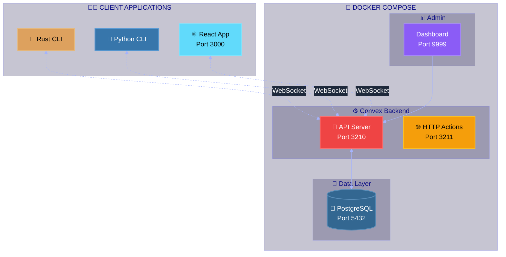
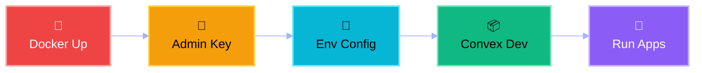
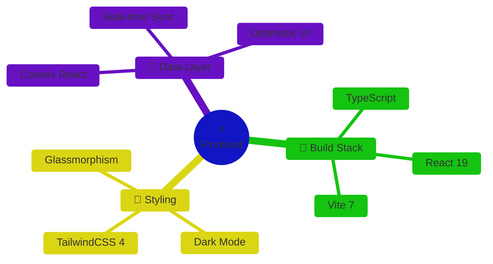

<div align="center">

<!-- ═══════════════════════════════════════════════════════════════════════════ -->
<!--                              HERO SECTION                                    -->
<!-- ═══════════════════════════════════════════════════════════════════════════ -->

<br>


<br><br>

# 📝 Convex Notes

### ✨ _A stunning, self-hosted real-time notes application_ ✨

<br>

[⚡ Quick Start](#-quick-start) &nbsp;•&nbsp;
[🏗️ Architecture](#%EF%B8%8F-architecture) &nbsp;•&nbsp;
[🦀 Rust CLI](#-rust-cli) &nbsp;•&nbsp;
[🐍 Python CLI](#-python-cli) &nbsp;•&nbsp;
[⚛️ Frontend](#%EF%B8%8F-react-frontend)

<br>


</div>

<br>

---

<br>

## 🎯 Why Convex Notes?

> **Own your data. Control your backend. Build in Rust or Python.**

<table>
<tr>
<td align="center" width="25%">
<br>

<br><br>
<strong>🏠 Self-Hosted</strong>
<br><br>
<sub>No cloud lock-in<br>Full data ownership</sub>
<br><br>
</td>
<td align="center" width="25%">
<br>

<br><br>
<strong>🦀 Rust CLI</strong>
<br><br>
<sub>Blazing fast<br>Memory safe</sub>
<br><br>
</td>
<td align="center" width="25%">
<br>

<br><br>
<strong>🐍 Python CLI</strong>
<br><br>
<sub>Rich terminal UI<br>Pydantic models</sub>
<br><br>
</td>
<td align="center" width="25%">
<br>

<br><br>
<strong>⚛️ Modern UI</strong>
<br><br>
<sub>React 19 + Vite 7<br>Glassmorphism</sub>
<br><br>
</td>
</tr>
</table>

<br>

---

<br>

## 🏗️ Architecture

<br>



<br>

---

<br>

## 🚀 Quick Start

<br>

### 📋 Prerequisites

|     | Tool       | Purpose           | Install                                |
| :-: | :--------- | :---------------- | :------------------------------------- |
| 🐳  | **Docker** | Container runtime | [↗ docker.com](https://docker.com)     |
| 🦀  | **Rust**   | Rust CLI          | [↗ rustup.rs](https://rustup.rs)       |
| 🐍  | **uv**     | Python CLI        | [↗ astral.sh/uv](https://astral.sh/uv) |
| 📦  | **Bun**    | Package manager   | [↗ bun.sh](https://bun.sh)             |
| 📋  | **Task**   | Task automation   | [↗ taskfile.dev](https://taskfile.dev) |

<br>

### ⚡ Express Setup

```bash
# One-liner to get started
task setup && task docker:up && task admin:key

# Copy the admin key to .env.local, then run in separate terminals:
task convex:dev      # Terminal 1 - Push functions
task frontend:dev    # Terminal 2 - React frontend
task rust:run        # Terminal 3 - Rust CLI
task python:run      # Terminal 4 - Python CLI (alternative)
```

<br>

### 📖 Step-by-Step Flow



<details>
<summary><kbd>📋 Detailed Commands</kbd></summary>

<br>

```bash
# 1️⃣ Start Docker services
task docker:up

# 2️⃣ Generate admin key
task admin:key

# 3️⃣ Update .env.local with the generated key
# CONVEX_SELF_HOSTED_ADMIN_KEY='your-key-here'

# 4️⃣ Push Convex functions (keep this terminal running)
task convex:dev

# 5️⃣ Start applications (in separate terminals)
task frontend:dev  # React at http://localhost:3000
task rust:run      # Rust CLI
task python:run    # Python CLI (alternative)
```

</details>

<br>

---

<br>

## 🦀 Rust CLI

<br>

> ### _Blazing fast terminal experience with clean architecture_

<br>

```
╔══════════════════════════════════════════════════════════╗
║           📝 CONVEX NOTES MANAGER                        ║
║         Self-Hosted • Rust Client • v0.1.0               ║
╚══════════════════════════════════════════════════════════╝

🚀 Connecting to http://127.0.0.1:3210...
✅ Connected to Convex backend!

? What would you like to do?
❯ 📋 List all notes
  ✏️  Create a new note
  📝 Update a note
  🗑️  Delete a note
  👀 Watch notes (real-time)
  🚪 Exit
```

<br>

### 🏛️ Clean Architecture

```
backend/
├── Cargo.toml              # Workspace root
└── crates/
    ├── common/             # 🔧 Config & utilities
    ├── db/                 # 💾 Entity, Repository, Service
    ├── convex-client/      # 🔗 Convex adapter
    └── cli/                # 🖥️ UI & handlers
```

<br>

| Crate            | Purpose             |
| :--------------- | :------------------ |
| `convex`         | Convex client SDK   |
| `colored`        | Terminal colors     |
| `dialoguer`      | Interactive prompts |
| `prettytable-rs` | Formatted tables    |

<br>

---

<br>

## 🐍 Python CLI

<br>

> ### _Beautiful Rich terminal UI with Pydantic validation_

<br>

```
╭──────────────────────────────────────────────────────────────╮
│           📝 CONVEX NOTES MANAGER                            │
│         Self-Hosted • Python Client • v0.1.0                 │
╰──────────────────────────────────────────────────────────────╯

🚀 Connecting to http://127.0.0.1:3210...
✅ Connected to Convex backend!

What would you like to do?
  1. 📋 List all notes
  2. ✏️  Create a new note
  3. 📝 Update a note
  4. 🗑️  Delete a note
  5. 👀 Watch notes (real-time)
  6. 🚪 Exit
```

<br>

### 🏛️ Clean Architecture

```
python-cli/
├── pyproject.toml          # uv project config
└── src/convex_notes/
    ├── entity/             # 📦 Pydantic models
    ├── repository/         # 🔗 Protocol + Convex adapter
    ├── service/            # 🧠 Business logic
    ├── handlers/           # 🎯 Command handlers
    └── ui/                 # 🎨 Rich components
```

<br>

| Package    | Purpose            |
| :--------- | :----------------- |
| `convex`   | Convex client SDK  |
| `rich`     | Beautiful terminal |
| `pydantic` | Data validation    |
| `typer`    | CLI framework      |

<br>

---

<br>

## ⚛️ React Frontend

<br>

> ### _Modern glassmorphism UI with real-time Convex updates_

<br>



<br>

|     | Feature             | Description                    |
| :-: | :------------------ | :----------------------------- |
| 🌙  | **Dark Mode**       | Purple gradient backgrounds    |
| 💫  | **Glassmorphism**   | Cards with backdrop blur       |
| ⚡  | **Instant Updates** | Real-time Convex subscriptions |
| 📱  | **Responsive**      | Mobile-first design            |

<br>

---

<br>

## 📁 Project Structure

<br>

```
📦 convex-notes/
│
├── 🐳 docker-compose.yml      ← PostgreSQL + Convex + Dashboard
├── 📋 Taskfile.yml            ← Task automation commands
├── 🔐 .env.local              ← Environment secrets (gitignored)
│
├── 📂 convex/                 ← Convex backend functions
│   ├── schema.ts              ← Database schema
│   └── notes.ts               ← CRUD handlers
│
├── 🦀 backend/                ← Rust CLI (workspace)
│   └── crates/                ← common, db, convex-client, cli
│
├── 🐍 python-cli/             ← Python CLI (uv project)
│   └── src/convex_notes/      ← entity, repository, service, handlers
│
├── ⚛️ frontend/               ← React application
│   └── src/                   ← hooks, routes, integrations
│
└── 💾 data/                   ← Local persistence (gitignored)
```

<br>

---

<br>

## 🛠️ Task Commands

<br>

| Command             | Description                    |
| :------------------ | :----------------------------- |
| `task`              | List all available commands    |
| `task setup`        | Install all dependencies       |
| `task docker:up`    | Start Docker containers        |
| `task docker:down`  | Stop Docker containers         |
| `task convex:dev`   | Push & watch Convex functions  |
| `task frontend:dev` | Start React development server |
| `task rust:run`     | Run Rust CLI                   |
| `task python:run`   | Run Python CLI                 |

<br>

---

<br>

## 🔗 Service URLs

<br>

|     | Service       | URL                     | Description            |
| :-: | :------------ | :---------------------- | :--------------------- |
| 🔧  | **Backend**   | `http://127.0.0.1:3210` | Convex API endpoint    |
| 🌐  | **HTTP**      | `http://127.0.0.1:3211` | HTTP action handlers   |
| 📊  | **Dashboard** | `http://localhost:9999` | Convex admin interface |
| ⚛️  | **Frontend**  | `http://localhost:3000` | React application      |
| 🐘  | **Postgres**  | `localhost:5432`        | PostgreSQL database    |

<br>

---

<br>

## 🐛 Troubleshooting

<br>

<details>
<summary><kbd>🚫 Port already in use</kbd></summary>

<br>

Windows Hyper-V may reserve certain port ranges. To check:

```powershell
netsh interface ipv4 show excludedportrange protocol=tcp
```

**Solution:** Change the conflicting port in `docker-compose.yml`.

</details>

<details>
<summary><kbd>🔌 Connection failed</kbd></summary>

<br>

1. Verify Docker is running: `docker ps`
2. Check container logs: `task docker:logs`
3. Ensure `.env.local` contains correct `CONVEX_URL`

</details>

<details>
<summary><kbd>📦 Functions not found</kbd></summary>

<br>

Run `task convex:dev` and wait for the message: _"Convex functions ready!"_

</details>

<details>
<summary><kbd>🐍 Python errors</kbd></summary>

<br>

```bash
cd python-cli
uv sync          # Install dependencies
uv run convex-notes  # Run CLI
```

</details>

<br>

---

<br>

<div align="center">

### Built with ❤️ using

[**Convex**](https://convex.dev) &nbsp;•&nbsp;
[**Rust**](https://rust-lang.org) &nbsp;•&nbsp;
[**Python**](https://python.org) &nbsp;•&nbsp;
[**React**](https://react.dev) &nbsp;•&nbsp;
[**PostgreSQL**](https://postgresql.org)

<br>

<sub>MIT License © 2025</sub>

</div>
