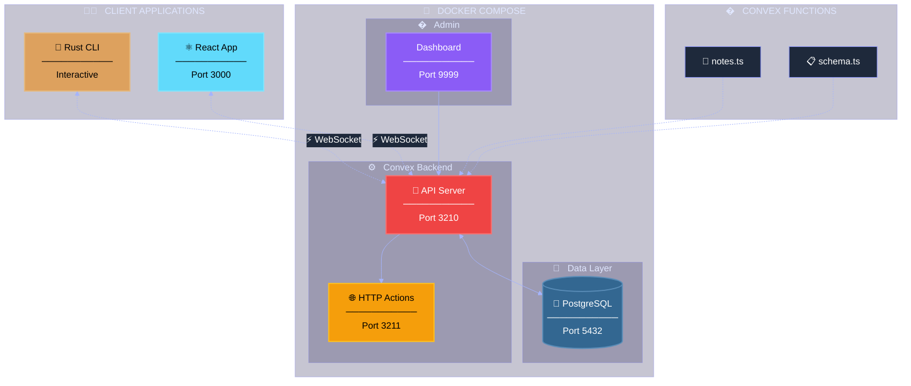
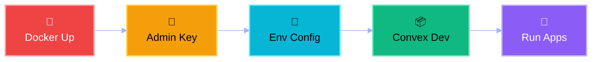
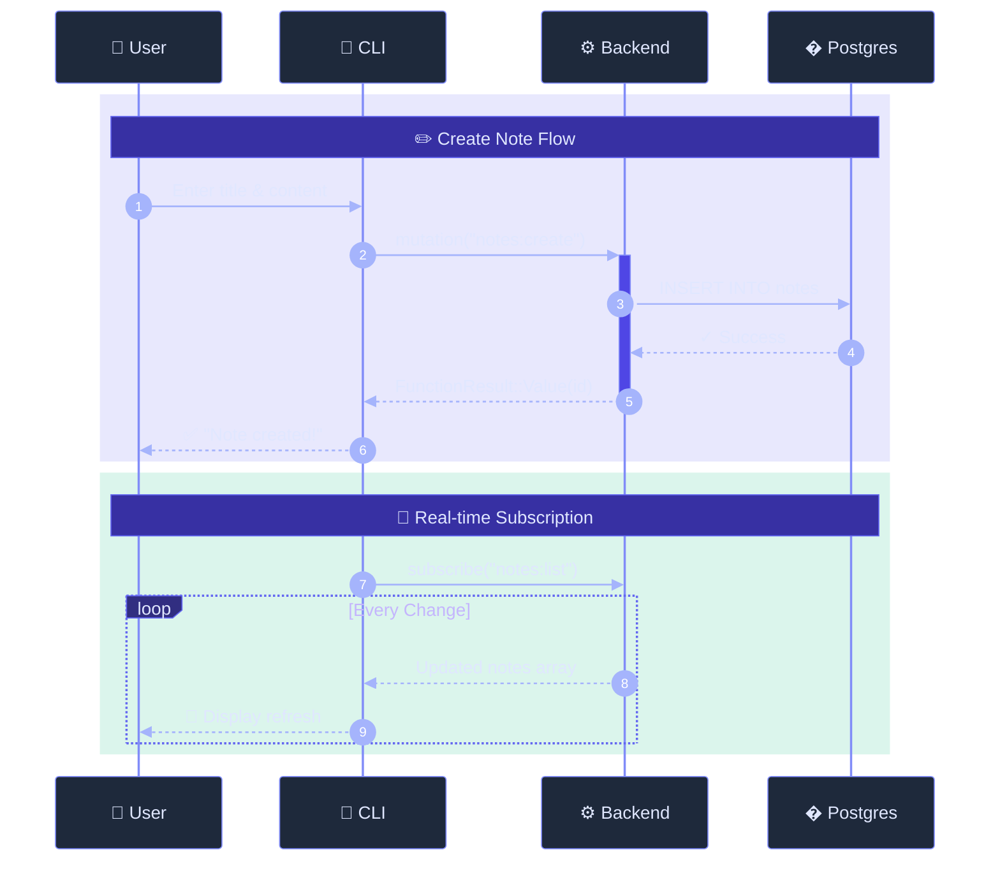
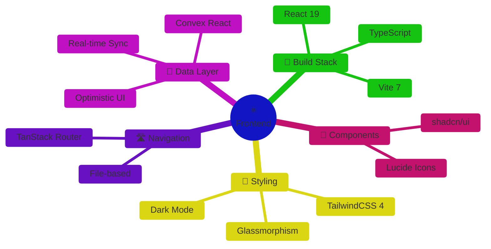
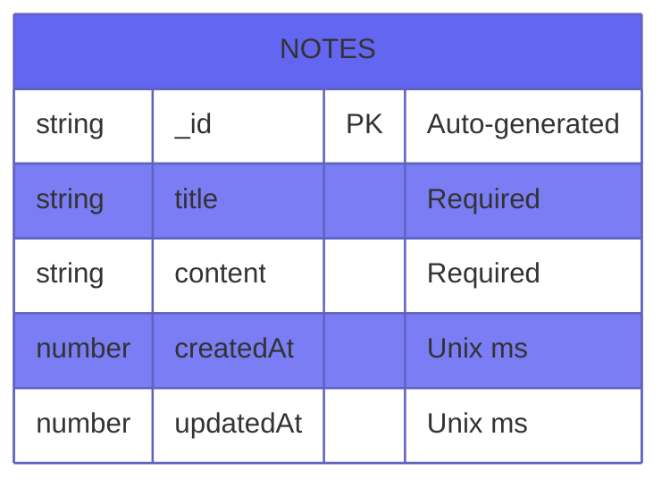

<div align="center">

<!-- Hero Section with Animated Gradient Background Effect -->
<br>


<br><br>

# 📝 Convex Notes

### ✨ _A stunning, self-hosted real-time notes application_ ✨

<br>

**[⚡ Quick Start](#-quick-start)** &nbsp;•&nbsp;
**[🏗️ Architecture](#%EF%B8%8F-architecture)** &nbsp;•&nbsp;
**[🦀 CLI](#-rust-cli)** &nbsp;•&nbsp;
**[⚛️ Frontend](#%EF%B8%8F-react-frontend)** &nbsp;•&nbsp;
**[📚 Docs](#-documentation)**

<br>


</div>

<br>

---

<br>

## 🎯 Why Convex Notes?

> **Own your data. Control your backend. Build in Rust.**

<table>
<tr>
<td align="center" width="25%">
<br>

<br><br>
<strong>🏠 Self-Hosted</strong>
<br>
<sub>No cloud lock-in<br>Full data ownership</sub>
<br><br>
</td>
<td align="center" width="25%">
<br>

<br><br>
<strong>🦀 Rust Powered</strong>
<br>
<sub>Blazing fast CLI<br>Memory safe</sub>
<br><br>
</td>
<td align="center" width="25%">
<br>

<br><br>
<strong>⚛️ Modern UI</strong>
<br>
<sub>React 19 + Vite 7<br>Glassmorphism</sub>
<br><br>
</td>
<td align="center" width="25%">
<br>

<br><br>
<strong>⚡ Real-Time</strong>
<br>
<sub>WebSocket sync<br>Instant updates</sub>
<br><br>
</td>
</tr>
</table>

<br>

---

<br>

## 🏗️ Architecture

<br>



<br>

---

<br>

## 🚀 Quick Start

<br>

### 📋 Prerequisites

|     | Tool       | Purpose           | Install                                |
| :-: | :--------- | :---------------- | :------------------------------------- |
| 🐳  | **Docker** | Container runtime | [↗ docker.com](https://docker.com)     |
| 🦀  | **Rust**   | CLI application   | [↗ rustup.rs](https://rustup.rs)       |
| 📦  | **Bun**    | Package manager   | [↗ bun.sh](https://bun.sh)             |
| 📋  | **Task**   | Task automation   | [↗ taskfile.dev](https://taskfile.dev) |

<br>

### ⚡ Express Setup

```bash
task setup && task docker:up && task admin:key
# Copy key to .env.local, then:
task convex:dev      # Terminal 1
task frontend:dev    # Terminal 2
task rust:run        # Terminal 3
```

<br>

### 📖 Step-by-Step



<br>

<details>
<summary><kbd>� Click for detailed commands</kbd></summary>

<br>

```bash
# 1️⃣ Start Docker services
task docker:up

# 2️⃣ Generate admin key
task admin:key

# 3️⃣ Update .env.local with the key
# CONVEX_SELF_HOSTED_ADMIN_KEY='your-key-here'

# 4️⃣ Push Convex functions (keep running)
task convex:dev

# 5️⃣ Start apps (separate terminals)
task frontend:dev  # React at :3000
task rust:run      # Rust CLI
```

</details>

<br>

---

<br>

## 🦀 Rust CLI

<br>

> ### _Beautiful terminal experience with interactive menus_

<br>

```ansi
╔══════════════════════════════════════════════════════════╗
║                                                          ║
║           📝 CONVEX NOTES MANAGER                        ║
║         Self-Hosted • Rust Client • v0.1.0               ║
║                                                          ║
╚══════════════════════════════════════════════════════════╝

🚀 Connecting to http://127.0.0.1:3210...
✅ Connected to Convex backend!

? What would you like to do?
❯ 📋 List all notes
  ✏️  Create a new note
  📝 Update a note
  🗑️  Delete a note
  👀 Watch notes (real-time)
  🚪 Exit
```

<br>

### 📦 Dependencies

| Crate            | Purpose             |     |
| :--------------- | :------------------ | :-: |
| `convex`         | Convex client SDK   | 🔗  |
| `colored`        | Terminal colors     | 🎨  |
| `dialoguer`      | Interactive prompts | 💬  |
| `prettytable-rs` | Formatted tables    | 📊  |
| `envconfig`      | Config management   | ⚙️  |
| `chrono`         | Date/time           | 🕐  |
| `tokio`          | Async runtime       | ⚡  |
| `futures`        | Stream handling     | 🌊  |

<br>

### 🔄 Data Flow



<br>

---

<br>

## ⚛️ React Frontend

<br>

> ### _Modern glassmorphism UI with real-time updates_

<br>



<br>

### ✨ Features

|     | Feature             | Description                 |
| :-: | :------------------ | :-------------------------- |
|  �  | **Dark Mode**       | Purple gradient backgrounds |
| 💫  | **Glassmorphism**   | Cards with backdrop blur    |
| ⚡  | **Instant Updates** | Convex subscriptions        |
| 📱  | **Responsive**      | All screen sizes            |
|  �  | **Optimistic UI**   | Snappy interactions         |

<br>

---

<br>

## 📁 Project Structure

<br>

```
📦 convex-notes/
│
├── 🐳 docker-compose.yml     ← PostgreSQL + Convex + Dashboard
├── 📋 Taskfile.yml           ← Task automation
├── 🔐 .env.local             ← Environment secrets
│
├── 📂 convex/                ← Backend functions
│   ├── schema.ts             ← Database schema
│   └── notes.ts              ← CRUD operations
│
├── 🦀 backend/               ← Rust CLI
│   ├── Cargo.toml
│   └── src/main.rs
│
├── ⚛️ frontend/              ← React app
│   └── src/
│       ├── hooks/useNotes.ts
│       └── routes/index.tsx
│
└── 💾 data/                  ← Local persistence
    ├── postgres/             ← PostgreSQL data
    └── convex/               ← Convex cache
```

<br>

---

<br>

## 📝 Database Schema

<br>



<details>
<summary><kbd>📄 View TypeScript Schema</kbd></summary>

```typescript
// convex/schema.ts
export default defineSchema({
  notes: defineTable({
    title: v.string(),
    content: v.string(),
    createdAt: v.number(),
    updatedAt: v.number(),
  }).index("by_created", ["createdAt"]),
});
```

</details>

<br>

---

<br>

## 🛠️ Task Commands

<br>

| Command             | Description            |
| :------------------ | :--------------------- |
| `task`              | List all commands      |
| `task setup`        | Install everything     |
| `task docker:up`    | Start containers       |
| `task docker:down`  | Stop containers        |
| `task docker:logs`  | View logs              |
| `task admin:key`    | Generate admin key     |
| `task convex:dev`   | Push & watch functions |
| `task frontend:dev` | Start React            |
| `task rust:run`     | Run CLI                |
| `task rust:watch`   | Auto-rebuild           |

<br>

---

<br>

## 🔗 Service URLs

<br>

|     | Service       | URL                     | Description  |
| :-: | :------------ | :---------------------- | :----------- |
| 🔧  | **Backend**   | `http://127.0.0.1:3210` | Convex API   |
| 🌐  | **HTTP**      | `http://127.0.0.1:3211` | HTTP Actions |
| 📊  | **Dashboard** | `http://localhost:9999` | Admin UI     |
| ⚛️  | **Frontend**  | `http://localhost:3000` | React App    |
| 🐘  | **Postgres**  | `localhost:5432`        | Database     |

<br>

---

<br>

## � Documentation

<br>

<details>
<summary><kbd>🚫 Port already in use</kbd></summary>

<br>

Windows Hyper-V may reserve ports:

```powershell
netsh interface ipv4 show excludedportrange protocol=tcp
```

Change ports in `docker-compose.yml` if needed.

</details>

<details>
<summary><kbd>🔌 Connection failed</kbd></summary>

<br>

1. Check Docker: `docker ps`
2. View logs: `task docker:logs`
3. Verify `.env.local` has correct `CONVEX_URL`

</details>

<details>
<summary><kbd>📦 Functions not found</kbd></summary>

<br>

Run `task convex:dev` and wait for "Convex functions ready!"

</details>

<details>
<summary><kbd>🦀 Rust errors</kbd></summary>

<br>

```bash
cargo check  # See detailed errors
cargo clean  # Clear cache and rebuild
```

</details>

<br>

---

<br>

<div align="center">

**Built with ❤️ using**

[Convex](https://convex.dev) &nbsp;•&nbsp; [Rust](https://rust-lang.org) &nbsp;•&nbsp; [React](https://react.dev) &nbsp;•&nbsp; [PostgreSQL](https://postgresql.org)

<br>

<sub>MIT License © 2025</sub>

</div>
