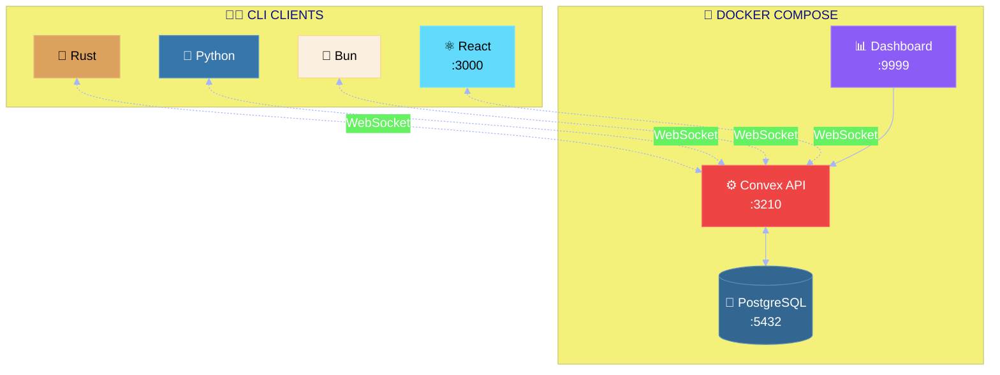

<div align="center">

<!-- ═══════════════════════════════════════════════════════════════════════════ -->
<!--                              HERO SECTION                                    -->
<!-- ═══════════════════════════════════════════════════════════════════════════ -->

<br>


<br><br>

# 📝 Convex Notes

### ✨ _A stunning, self-hosted real-time notes application_ ✨

<br>

[⚡ Quick Start](#-quick-start) &nbsp;•&nbsp;
[🏗️ Architecture](#%EF%B8%8F-architecture) &nbsp;•&nbsp;
[🦀 Rust](#-rust-cli) &nbsp;•&nbsp;
[🐍 Python](#-python-cli) &nbsp;•&nbsp;
[🥟 Bun](#-bun-cli) &nbsp;•&nbsp;
[⚛️ React](#%EF%B8%8F-react-frontend)

<br>


</div>

<br>

---

<br>

## 🎯 Why Convex Notes?

> **Own your data. Control your backend. Choose your language.**

<table>
<tr>
<td align="center" width="20%">
<br>

<br><br>
<strong>🏠 Self-Hosted</strong>
<br>
<sub>No cloud lock-in</sub>
<br><br>
</td>
<td align="center" width="20%">
<br>

<br><br>
<strong>🦀 Rust CLI</strong>
<br>
<sub>Blazing fast</sub>
<br><br>
</td>
<td align="center" width="20%">
<br>

<br><br>
<strong>🐍 Python CLI</strong>
<br>
<sub>Rich terminal</sub>
<br><br>
</td>
<td align="center" width="20%">
<br>

<br><br>
<strong>🥟 Bun CLI</strong>
<br>
<sub>TypeScript</sub>
<br><br>
</td>
<td align="center" width="20%">
<br>

<br><br>
<strong>⚛️ React</strong>
<br>
<sub>Modern UI</sub>
<br><br>
</td>
</tr>
</table>

<br>

---

<br>

## 🏗️ Architecture

<br>



<br>

---

<br>

## 🚀 Quick Start

<br>

### 📋 Prerequisites

|     | Tool       | Purpose         | Install                              |
| :-: | :--------- | :-------------- | :----------------------------------- |
| 🐳  | **Docker** | Containers      | [docker.com](https://docker.com)     |
| 🦀  | **Rust**   | Rust CLI        | [rustup.rs](https://rustup.rs)       |
| 🐍  | **uv**     | Python CLI      | [astral.sh/uv](https://astral.sh/uv) |
| 🥟  | **Bun**    | Bun CLI         | [bun.sh](https://bun.sh)             |
| 📋  | **Task**   | Task automation | [taskfile.dev](https://taskfile.dev) |

<br>

### ⚡ Express Setup

```bash
# Start everything
task setup && task docker:up && task admin:key

# Copy the admin key to .env.local, then run:
task convex:dev      # Terminal 1 - Push functions
task frontend:dev    # Terminal 2 - React frontend

# Run ANY CLI (pick one):
task rust:run        # 🦀 Rust CLI
task python:run      # 🐍 Python CLI
task bun:run         # 🥟 Bun CLI
```

<details>
<summary><kbd>📋 Detailed Commands</kbd></summary>

<br>

```bash
# 1️⃣ Start Docker services
task docker:up

# 2️⃣ Generate admin key
task admin:key

# 3️⃣ Update .env.local with the generated key
# CONVEX_SELF_HOSTED_ADMIN_KEY='your-key-here'

# 4️⃣ Push Convex functions (keep running)
task convex:dev

# 5️⃣ Start applications
task frontend:dev  # React at http://localhost:3000
task rust:run      # Rust CLI
task python:run    # Python CLI
task bun:run       # Bun CLI
```

</details>

<br>

---

<br>

## 🦀 Rust CLI

> _Blazing fast with clean architecture_

```
╔══════════════════════════════════════════════════════════╗
║           📝 CONVEX NOTES MANAGER                        ║
║         Self-Hosted • Rust Client • v0.1.0               ║
╚══════════════════════════════════════════════════════════╝

? What would you like to do?
❯ 📋 List all notes
  ✏️  Create a new note
  📝 Update a note
  🗑️  Delete a note
  👀 Watch notes (real-time)
```

```
backend/crates/
├── common/         # Config & utilities
├── db/             # Entity, Repository, Service
├── convex-client/  # Convex adapter
└── cli/            # UI & handlers
```

| Crate       | Purpose         |
| :---------- | :-------------- |
| `convex`    | Backend SDK     |
| `dialoguer` | CLI prompts     |
| `colored`   | Terminal colors |

<br>

---

<br>

## 🐍 Python CLI

> _Beautiful Rich terminal with Pydantic validation_

```
╭──────────────────────────────────────────────────────────╮
│           📝 CONVEX NOTES MANAGER                        │
│         Self-Hosted • Python Client • v0.1.0             │
╰──────────────────────────────────────────────────────────╯

What would you like to do?
  1. 📋 List all notes
  2. ✏️  Create a new note
  3. 📝 Update a note
```

```
python-cli/src/convex_notes/
├── entity/         # Pydantic models
├── repository/     # Protocol + Convex
├── service/        # Business logic
├── handlers/       # Commands
└── ui/             # Rich components
```

| Package    | Purpose          |
| :--------- | :--------------- |
| `convex`   | Backend SDK      |
| `rich`     | Beautiful output |
| `pydantic` | Data validation  |

<br>

---

<br>

## 🥟 Bun CLI

> _TypeScript with @clack/prompts_

```
╔══════════════════════════════════════════════════════════╗
║           📝 CONVEX NOTES MANAGER                        ║
║         Self-Hosted • Bun Client • v0.1.0                ║
╚══════════════════════════════════════════════════════════╝

◆  What would you like to do?
│  � List all notes
│  ✏️  Create a new note
│  📝 Update a note
```

```
bun-cli/src/
├── entity/         # TypeScript types
├── repository/     # Interface + Convex
├── service/        # Business logic
├── handlers/       # Commands
└── ui/             # picocolors
```

| Package          | Purpose         |
| :--------------- | :-------------- |
| `convex`         | Backend SDK     |
| `@clack/prompts` | CLI prompts     |
| `picocolors`     | Terminal colors |

<br>

---

<br>

## ⚛️ React Frontend

> _Glassmorphism UI with real-time updates_

|     | Feature             | Description                    |
| :-: | :------------------ | :----------------------------- |
| 🌙  | **Dark Mode**       | Purple gradient backgrounds    |
| 💫  | **Glassmorphism**   | Cards with backdrop blur       |
| ⚡  | **Instant Updates** | Real-time Convex subscriptions |
| 📱  | **Responsive**      | Mobile-first design            |

<br>

---

<br>

## 📁 Project Structure

```
📦 convex-notes/
├── 🐳 docker-compose.yml      ← PostgreSQL + Convex
├── 📋 Taskfile.yml            ← Task automation
├── 📂 convex/                 ← Backend functions
├── 🦀 backend/                ← Rust CLI (workspace)
├── 🐍 python-cli/             ← Python CLI (uv)
├── 🥟 bun-cli/                ← Bun CLI (TypeScript)
├── ⚛️ frontend/               ← React application
└── 💾 data/                   ← Local persistence
```

<br>

---

<br>

## 🛠️ Task Commands

| Command             | Description                   |
| :------------------ | :---------------------------- |
| `task setup`        | Install all dependencies      |
| `task docker:up`    | Start Docker containers       |
| `task convex:dev`   | Push & watch Convex functions |
| `task frontend:dev` | React at :3000                |
| `task rust:run`     | Run Rust CLI                  |
| `task python:run`   | Run Python CLI                |
| `task bun:run`      | Run Bun CLI                   |

<br>

---

<br>

## 🔗 Service URLs

|     | Service       | URL                     |
| :-: | :------------ | :---------------------- |
| 🔧  | **Backend**   | `http://127.0.0.1:3210` |
| 📊  | **Dashboard** | `http://localhost:9999` |
| ⚛️  | **Frontend**  | `http://localhost:3000` |
| 🐘  | **Postgres**  | `localhost:5432`        |

<br>

---

<br>

## 🐛 Troubleshooting

<details>
<summary><kbd>🔌 Connection failed</kbd></summary>

1. Verify Docker is running: `docker ps`
2. Check container logs: `task docker:logs`
3. Ensure `.env.local` contains correct `CONVEX_URL`

</details>

<details>
<summary><kbd>📦 Functions not found</kbd></summary>

Run `task convex:dev` and wait for _"Convex functions ready!"_

</details>

<br>

---

<br>

<div align="center">

### Built with ❤️ using

[**Convex**](https://convex.dev) &nbsp;•&nbsp;
[**Rust**](https://rust-lang.org) &nbsp;•&nbsp;
[**Python**](https://python.org) &nbsp;•&nbsp;
[**Bun**](https://bun.sh) &nbsp;•&nbsp;
[**React**](https://react.dev)

<sub>MIT License © 2025</sub>

</div>
