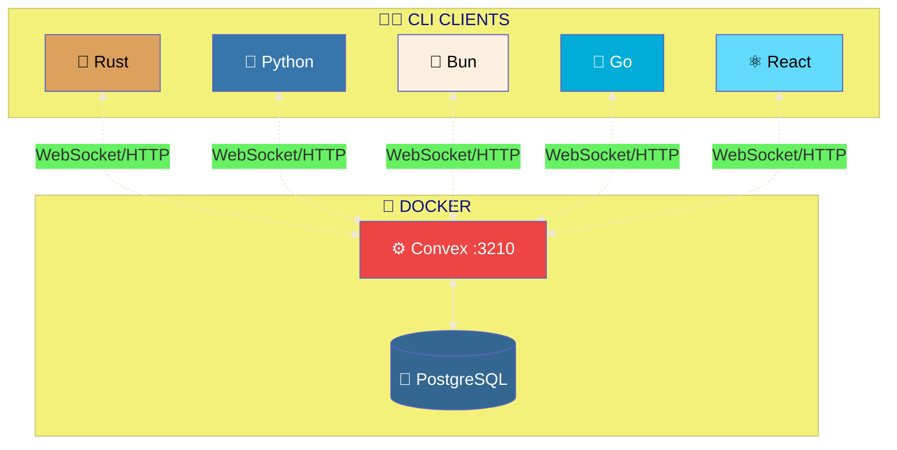

<div align="center">

<!-- ═══════════════════════════════════════════════════════════════════════════ -->
<!--                              HERO SECTION                                    -->
<!-- ═══════════════════════════════════════════════════════════════════════════ -->

<br>


<br><br>

# 📝 Convex Notes

### ✨ _A stunning, self-hosted real-time notes application_ ✨

<br>

[⚡ Quick Start](#-quick-start) &nbsp;•&nbsp;
[🦀 Rust](#-rust-cli) &nbsp;•&nbsp;
[🐍 Python](#-python-cli) &nbsp;•&nbsp;
[🥟 Bun](#-bun-cli) &nbsp;•&nbsp;
[🐹 Go](#-go-cli) &nbsp;•&nbsp;
[⚡ Zig](#-zig-cli) &nbsp;•&nbsp;
[⚛️ React](#%EF%B8%8F-react-frontend)

<br>


</div>

<br>

---

<br>

## 🎯 Why Convex Notes?

> **Own your data. Control your backend. Choose your language.**

<table>
<tr>
<td align="center" width="16%">

<br>
<strong>🏠 Self-Hosted</strong>
</td>
<td align="center" width="16%">

<br>
<strong>🦀 Rust</strong>
</td>
<td align="center" width="16%">

<br>
<strong>🐍 Python</strong>
</td>
<td align="center" width="16%">

<br>
<strong>🥟 Bun</strong>
</td>
<td align="center" width="16%">

<br>
<strong>🐹 Go</strong>
</td>
<td align="center" width="16%">

<br>
<strong>⚛️ React</strong>
</td>
</tr>
</table>

<br>

---

<br>

## 🏗️ Architecture



<br>

---

<br>

## 🚀 Quick Start

### 📋 Prerequisites

| Tool      | Purpose    | Install                              |
| --------- | ---------- | ------------------------------------ |
| 🐳 Docker | Containers | [docker.com](https://docker.com)     |
| 🦀 Rust   | Rust CLI   | [rustup.rs](https://rustup.rs)       |
| 🐍 uv     | Python CLI | [astral.sh/uv](https://astral.sh/uv) |
| 🥟 Bun    | Bun CLI    | [bun.sh](https://bun.sh)             |
| 🐹 Go     | Go CLI     | [go.dev](https://go.dev)             |

### ⚡ Express Setup

```bash
task setup && task docker:up && task admin:key
# Copy admin key to .env.local

task convex:dev      # Terminal 1
task frontend:dev    # Terminal 2

# Pick ANY CLI:
task rust:run        # 🦀 Rust
task python:run      # 🐍 Python
task bun:run         # 🥟 Bun
task go:run          # 🐹 Go
```

<br>

---

<br>

## 🦀 Rust CLI

> _Blazing fast with async Convex SDK_

```
backend/crates/
├── common/         # Config & utilities
├── db/             # Entity, Repository, Service
├── convex-client/  # Convex adapter
└── cli/            # UI & handlers
```

| Crate       | Purpose       |
| ----------- | ------------- |
| `convex`    | Native SDK    |
| `dialoguer` | CLI prompts   |
| `tokio`     | Async runtime |

<br>

---

<br>

## 🐍 Python CLI

> _Beautiful Rich terminal with Pydantic_

```
python-cli/src/convex_notes/
├── entity/         # Pydantic models
├── repository/     # Protocol + Convex
├── service/        # Business logic
└── handlers/       # Commands
```

| Package    | Purpose          |
| ---------- | ---------------- |
| `convex`   | Python SDK       |
| `rich`     | Beautiful output |
| `pydantic` | Validation       |

<br>

---

<br>

## 🥟 Bun CLI

> _TypeScript with @clack/prompts_

```
bun-cli/src/
├── entity/         # TypeScript types
├── repository/     # Interface + Convex
├── service/        # Business logic
├── handlers/       # Commands
└── ui/             # picocolors
```

| Package          | Purpose     |
| ---------------- | ----------- |
| `convex`         | JS SDK      |
| `@clack/prompts` | CLI prompts |
| `picocolors`     | Colors      |

<br>

---

<br>

## 🐹 Go CLI

> _Uber FX dependency injection + HTTP API_

```
go-cli/
├── main.go           # uber/fx DI setup
├── cmd/app.go        # Menu loop
└── internal/
    ├── entity/       # Note types
    ├── repository/   # Interface + HTTP
    ├── service/      # Business logic
    └── handler/      # Commands
```

| Package       | Purpose              |
| ------------- | -------------------- |
| `uber/fx`     | Dependency injection |
| `survey`      | CLI prompts          |
| `tablewriter` | Pretty tables        |

<br>

---

<br>

## ⚡ Zig CLI

> _Pure Zig with std.http.Client_

```
zig-cli/src/
├── main.zig          # Entry point
├── app.zig           # Menu loop
├── entity/           # Note types
├── repository/       # HTTP client
├── service/          # Business logic
├── handler/          # Commands
└── ui/               # ANSI colors
```

| Feature | Implementation            |
| ------- | ------------------------- |
| HTTP    | `std.http.Client`         |
| I/O     | `std.Io.Threaded`         |
| Memory  | `GeneralPurposeAllocator` |

<br>

---

<br>

## ⚛️ React Frontend

> _Glassmorphism UI with real-time updates_

| Feature          | Description          |
| ---------------- | -------------------- |
| 🌙 Dark Mode     | Purple gradients     |
| 💫 Glassmorphism | Backdrop blur        |
| ⚡ Real-time     | Convex subscriptions |

<br>

---

<br>

## 📁 Project Structure

```
📦 convex-notes/
├── 🐳 docker-compose.yml
├── 📂 convex/           # Backend functions
├── 🦀 backend/          # Rust CLI
├── 🐍 python-cli/       # Python CLI
├── 🥟 bun-cli/          # Bun CLI
├── 🐹 go-cli/           # Go CLI
└── ⚛️ frontend/         # React app
```

<br>

---

<br>

## 🛠️ Commands

| Command             | Description    |
| ------------------- | -------------- |
| `task rust:run`     | 🦀 Rust CLI    |
| `task python:run`   | 🐍 Python CLI  |
| `task bun:run`      | 🥟 Bun CLI     |
| `task go:run`       | 🐹 Go CLI      |
| `task frontend:dev` | ⚛️ React :3000 |

<br>

---

<br>

<div align="center">

### Built with ❤️

[**Convex**](https://convex.dev) • [**Rust**](https://rust-lang.org) • [**Python**](https://python.org) • [**Bun**](https://bun.sh) • [**Go**](https://go.dev) • [**React**](https://react.dev)

<sub>MIT License © 2025</sub>

</div>
