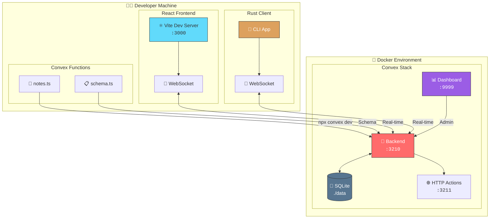
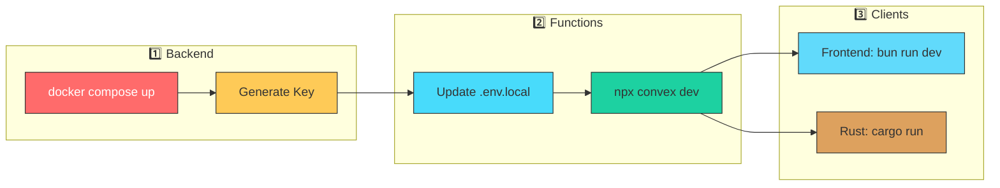
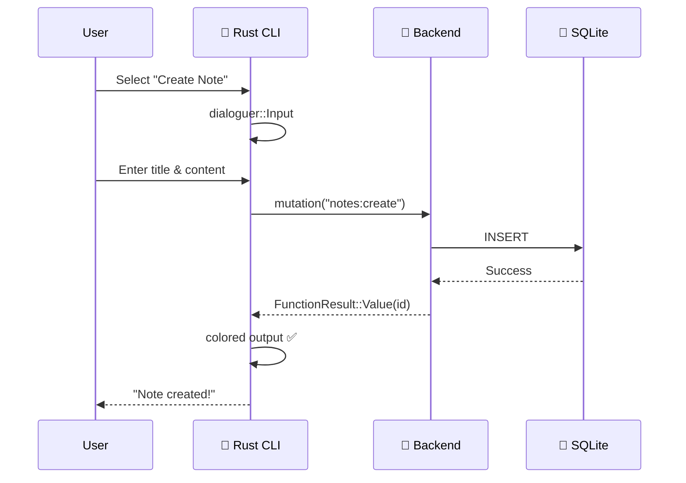
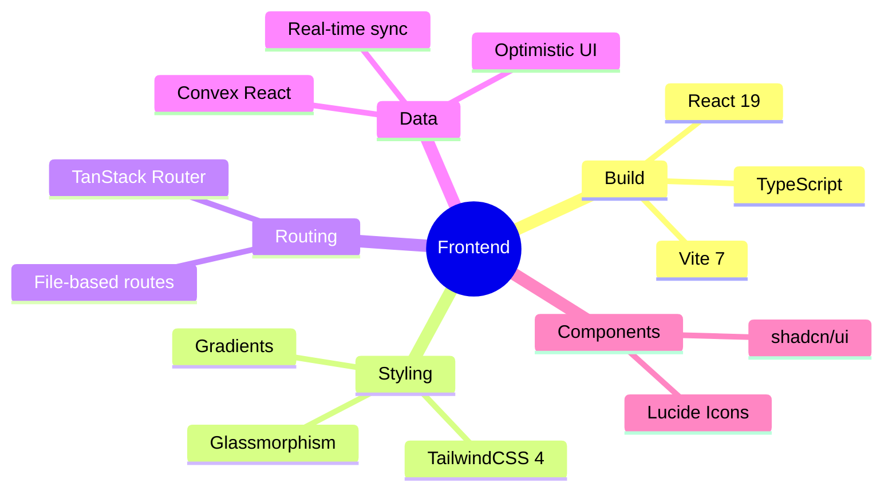
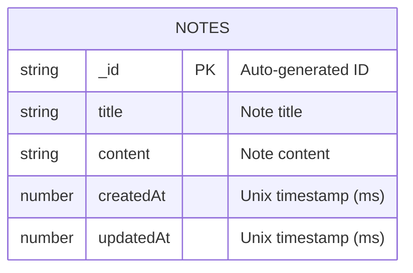

<p align="center">
  
  
  
  
</p>

<h1 align="center">📝 Convex Notes</h1>

<p align="center">
  <strong>A beautiful, self-hosted notes application with real-time sync</strong><br>
  <sub>Built with Convex • Rust • React • Docker</sub>
</p>

<p align="center">
  <a href="#-features">Features</a> •
  <a href="#-quick-start">Quick Start</a> •
  <a href="#-architecture">Architecture</a> •
  <a href="#-rust-cli">Rust CLI</a> •
  <a href="#-react-frontend">Frontend</a>
</p>

---

## ✨ Features

<table>
<tr>
<td width="50%">

### 🦀 Rust CLI

- Interactive terminal UI with colors
- Fuzzy-select menus with `dialoguer`
- Beautiful tables with `prettytable-rs`
- Real-time subscriptions via WebSocket
- Environment config with `envconfig`

</td>
<td width="50%">

### ⚛️ React Frontend

- Modern glassmorphism design
- Real-time updates with Convex React
- TailwindCSS v4 styling
- TanStack Router navigation
- Fully responsive layout

</td>
</tr>
<tr>
<td>

### 🐳 Self-Hosted Backend

- No cloud dependency
- Local SQLite storage
- Full data ownership
- Easy Docker deployment
- Admin dashboard included

</td>
<td>

### 🔄 Real-Time Sync

- Instant updates across all clients
- WebSocket subscriptions
- Optimistic UI updates
- Offline-first architecture
- Conflict-free data sync

</td>
</tr>
</table>

---

## 🏗️ Architecture



---

## 🚀 Quick Start

### Prerequisites

| Tool        | Purpose               | Install                              |
| ----------- | --------------------- | ------------------------------------ |
| 🐳 Docker   | Run Convex backend    | [docker.com](https://docker.com)     |
| 🦀 Rust     | CLI application       | [rustup.rs](https://rustup.rs)       |
| 📦 Bun/Node | Frontend & Convex CLI | [bun.sh](https://bun.sh)             |
| 📋 Task     | Task automation       | [taskfile.dev](https://taskfile.dev) |

### One-Command Setup

```bash
# Clone and enter the project
git clone <repo-url> && cd convex-notes

# Install everything
task setup
```

### Step-by-Step Guide



<details>
<summary><strong>📖 Detailed Instructions</strong></summary>

#### 1. Start the Docker Backend

```bash
task docker:up
# or: docker compose up -d
```

> 💡 The backend will be available at `http://127.0.0.1:3210`  
> 📊 Dashboard at `http://localhost:9999`

#### 2. Generate Admin Key

```bash
task admin:key
# or: docker compose exec backend ./generate_admin_key.sh
```

Copy the generated key to `.env.local`:

```env
CONVEX_SELF_HOSTED_URL='http://127.0.0.1:3210'
CONVEX_SELF_HOSTED_ADMIN_KEY='convex-self-hosted|your-key-here'
CONVEX_URL='http://127.0.0.1:3210'
```

#### 3. Push Convex Functions

```bash
task convex:dev
# or: npx convex dev
```

> ⏳ Keep this terminal running - it watches for changes

#### 4. Start the Frontend

```bash
task frontend:dev
# or: cd frontend && bun run dev
```

> 🌐 Open http://localhost:3000

#### 5. Run the Rust CLI

```bash
task rust:run
# or: cd backend && cargo run
```

</details>

---

## 🦀 Rust CLI

A beautiful terminal application with interactive menus and colored output.

### Screenshots

```
╔══════════════════════════════════════════════════════════╗
║                                                          ║
║           📝 CONVEX NOTES MANAGER                        ║
║         Self-Hosted • Rust Client • v0.1.0               ║
║                                                          ║
╚══════════════════════════════════════════════════════════╝

🚀 Connecting to http://127.0.0.1:3210...
✅ Connected to Convex backend!

? What would you like to do?
❯ 📋 List all notes
  ✏️  Create a new note
  📝 Update a note
  🗑️  Delete a note
  👀 Watch notes (real-time)
  🚪 Exit
```

### Dependencies

| Crate            | Purpose             |
| ---------------- | ------------------- |
| `convex`         | Convex Rust client  |
| `colored`        | Terminal colors     |
| `dialoguer`      | Interactive prompts |
| `prettytable-rs` | Formatted tables    |
| `envconfig`      | Configuration       |
| `chrono`         | Date formatting     |
| `tokio`          | Async runtime       |

### Data Flow



---

## ⚛️ React Frontend

A modern, glassmorphism-styled notes interface with real-time updates.

### Tech Stack



### Features

- 🎨 **Dark mode** with purple gradient backgrounds
- 💫 **Glassmorphism** cards with backdrop blur
- ⚡ **Instant updates** via Convex subscriptions
- 📱 **Responsive** design for all screen sizes
- 🔄 **Optimistic UI** for snappy interactions

---

## 📁 Project Structure

```
convex-notes/
├── 🐳 docker-compose.yml      # Self-hosted Convex stack
├── 📋 Taskfile.yml            # Task automation (task --list)
├── 🔐 .env.local              # Secrets (gitignored)
├── 📦 package.json            # Root dependencies
│
├── 📂 convex/                 # Convex backend functions
│   ├── schema.ts              # Database schema
│   └── notes.ts               # CRUD mutations/queries
│
├── 🦀 backend/                # Rust CLI application
│   ├── Cargo.toml             # Rust dependencies
│   └── src/
│       └── main.rs            # CLI entrypoint
│
├── ⚛️ frontend/               # React application
│   ├── index.html             # Entry HTML
│   ├── package.json           # Frontend deps
│   ├── vite.config.ts         # Vite configuration
│   └── src/
│       ├── main.tsx           # React entrypoint
│       ├── hooks/
│       │   └── useNotes.ts    # Convex data hook
│       ├── routes/
│       │   └── index.tsx      # Notes page
│       └── integrations/
│           └── convex/        # Convex setup
│
└── 📂 data/                   # SQLite storage (gitignored)
```

---

## 📝 Database Schema



```typescript
// convex/schema.ts
export default defineSchema({
  notes: defineTable({
    title: v.string(),
    content: v.string(),
    createdAt: v.number(),
    updatedAt: v.number(),
  }).index("by_created", ["createdAt"]),
});
```

---

## 🛠️ Available Tasks

Run `task` to see all available commands:

| Command               | Description               |
| --------------------- | ------------------------- |
| `task setup`          | Install all dependencies  |
| `task docker:up`      | Start Convex backend      |
| `task docker:down`    | Stop Convex backend       |
| `task docker:logs`    | View backend logs         |
| `task admin:key`      | Generate admin key        |
| `task convex:dev`     | Push & watch functions    |
| `task frontend:dev`   | Start React dev server    |
| `task frontend:build` | Build for production      |
| `task rust:run`       | Run Rust CLI              |
| `task rust:watch`     | Auto-rebuild on changes   |
| `task rust:check`     | Check for errors          |
| `task clean`          | Clean all build artifacts |

---

## 🔗 Service URLs

| Service             | URL                   | Description          |
| ------------------- | --------------------- | -------------------- |
| 🔧 **Backend**      | http://127.0.0.1:3210 | Convex API endpoint  |
| 🌐 **HTTP Actions** | http://127.0.0.1:3211 | HTTP action handlers |
| 📊 **Dashboard**    | http://localhost:9999 | Admin interface      |
| ⚛️ **Frontend**     | http://localhost:3000 | React application    |

---

## 🐛 Troubleshooting

<details>
<summary><strong>🚫 Port already in use</strong></summary>

Windows Hyper-V may reserve ports. Check with:

```powershell
netsh interface ipv4 show excludedportrange protocol=tcp
```

Solution: Change the port in `docker-compose.yml`

</details>

<details>
<summary><strong>🔌 Can't connect to backend</strong></summary>

1. Check Docker is running: `docker ps`
2. Verify backend health: `docker compose logs backend`
3. Ensure `.env.local` has correct `CONVEX_URL`

</details>

<details>
<summary><strong>📦 Functions not found</strong></summary>

Run `task convex:dev` and wait for "Convex functions ready!"

</details>

<details>
<summary><strong>🦀 Rust compilation errors</strong></summary>

```bash
cargo check  # See detailed errors
cargo clean  # Clear cache and rebuild
```

</details>

---

## 📄 License

MIT © 2024

---

<p align="center">
  Made with ❤️ using <a href="https://convex.dev">Convex</a>, <a href="https://rust-lang.org">Rust</a>, and <a href="https://react.dev">React</a>
</p>
