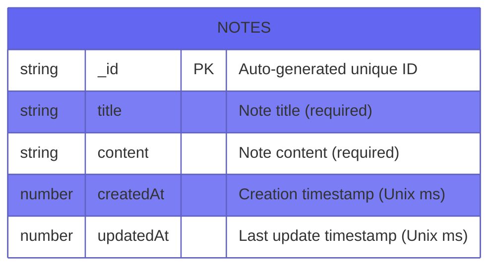

```mermaid
%%{init: {'theme': 'base', 'themeVariables': { 'primaryColor': '#6366f1', 'lineColor': '#a5b4fc', 'textColor': '#e2e8f0', 'background': '#0f172a'}}}%%

flowchart LR
    A["🐳<br/>Docker Up"]
    B["🔑<br/>Admin Key"]
    C["📝<br/>Env Config"]
    D["📦<br/>Convex Dev"]
    E["🚀<br/>Run Apps"]

    A --> B --> C --> D --> E

    style A fill:#ef4444,stroke:#fca5a5,stroke-width:2px,color:#fff
    style B fill:#f59e0b,stroke:#fcd34d,stroke-width:2px,color:#000
    style C fill:#06b6d4,stroke:#67e8f9,stroke-width:2px,color:#000
    style D fill:#10b981,stroke:#6ee7b7,stroke-width:2px,color:#000
    style E fill:#8b5cf6,stroke:#c4b5fd,stroke-width:2px,color:#fff
```

<div align="center">

<!-- ═══════════════════════════════════════════════════════════════════════════ -->
<!--                              HERO SECTION                                    -->
<!-- ═══════════════════════════════════════════════════════════════════════════ -->

<br>


<br><br>

# 📝 Convex Notes

### ✨ _A stunning, self-hosted real-time notes application_ ✨

<br>

[⚡ Quick Start](#-quick-start) &nbsp;•&nbsp;
[🏗️ Architecture](#%EF%B8%8F-architecture) &nbsp;•&nbsp;
[🦀 Rust CLI](#-rust-cli) &nbsp;•&nbsp;
[⚛️ Frontend](#%EF%B8%8F-react-frontend) &nbsp;•&nbsp;
[📚 Documentation](#-troubleshooting)

<br>


</div>

<br>

---

<br>

## 🎯 Why Convex Notes?

> **Own your data. Control your backend. Build with Rust.**

<table>
<tr>
<td align="center" width="25%">
<br>

<br><br>
<strong>🏠 Self-Hosted</strong>
<br><br>
<sub>No cloud lock-in<br>Full data ownership</sub>
<br><br>
</td>
<td align="center" width="25%">
<br>

<br><br>
<strong>🦀 Rust Powered</strong>
<br><br>
<sub>Blazing fast CLI<br>Memory safe</sub>
<br><br>
</td>
<td align="center" width="25%">
<br>

<br><br>
<strong>⚛️ Modern UI</strong>
<br><br>
<sub>React 19 + Vite 7<br>Glassmorphism</sub>
<br><br>
</td>
<td align="center" width="25%">
<br>

<br><br>
<strong>⚡ Real-Time</strong>
<br><br>
<sub>WebSocket sync<br>Instant updates</sub>
<br><br>
</td>
</tr>
</table>

<br>

---

<br>

## 🏗️ Architecture

```mermaid
%%{init: {'theme': 'base', 'themeVariables': { 'primaryColor': '#6366f1', 'primaryTextColor': '#fff', 'primaryBorderColor': '#818cf8', 'lineColor': '#a5b4fc', 'secondaryColor': '#1e1b4b', 'background': '#0f172a', 'mainBkg': '#1e293b', 'nodeBorder': '#818cf8', 'clusterBkg': '#1e1b4b40', 'clusterBorder': '#6366f150', 'edgeLabelBackground': '#1e293b'}}}%%

flowchart TB
    subgraph DOCKER["🐳 DOCKER COMPOSE"]
        direction TB

        subgraph DB_LAYER["💾 Data Layer"]
            PG[("🐘 PostgreSQL<br/>Port 5432")]
        end

        subgraph CONVEX["⚙️ Convex Backend"]
            API["🔧 API Server<br/>Port 3210"]
            HTTP["🌐 HTTP Actions<br/>Port 3211"]
        end

        subgraph ADMIN["📊 Admin"]
            DASH["Dashboard<br/>Port 9999"]
        end
    end

    subgraph CLIENTS["👨‍💻 CLIENT APPLICATIONS"]
        direction LR
        RUST["🦀 Rust CLI<br/>Interactive"]
        REACT["⚛️ React App<br/>Port 3000"]
    end

    subgraph FUNCTIONS["📂 CONVEX FUNCTIONS"]
        direction LR
        NOTES["notes.ts"]
        SCHEMA["schema.ts"]
    end

    RUST <-. "⚡ WebSocket" .-> API
    REACT <-. "⚡ WebSocket" .-> API
    API <--> PG
    API --> HTTP
    DASH --> API
    NOTES -.-> API
    SCHEMA -.-> API

    style PG fill:#336791,stroke:#5A8DB8,stroke-width:2px,color:#fff
    style API fill:#ef4444,stroke:#f87171,stroke-width:2px,color:#fff
    style HTTP fill:#f59e0b,stroke:#fbbf24,stroke-width:2px,color:#000
    style DASH fill:#8b5cf6,stroke:#a78bfa,stroke-width:2px,color:#fff
    style RUST fill:#dda15e,stroke:#e5b97e,stroke-width:2px,color:#000
    style REACT fill:#61dafb,stroke:#81e4fc,stroke-width:2px,color:#000
```

<br>



<br>

---

<br>

## 🚀 Quick Start

<br>

### 📋 Prerequisites

|     | Tool       | Purpose           | Install                                |
| :-: | :--------- | :---------------- | :------------------------------------- |
| 🐳  | **Docker** | Container runtime | [↗ docker.com](https://docker.com)     |
| 🦀  | **Rust**   | CLI application   | [↗ rustup.rs](https://rustup.rs)       |
| 📦  | **Bun**    | Package manager   | [↗ bun.sh](https://bun.sh)             |
| 📋  | **Task**   | Task automation   | [↗ taskfile.dev](https://taskfile.dev) |

<br>

### ⚡ Express Setup

```bash
# One-liner to get started
task setup && task docker:up && task admin:key

# Copy the admin key to .env.local, then run in separate terminals:
task convex:dev      # Terminal 1 - Push functions
task frontend:dev    # Terminal 2 - React frontend
task rust:run        # Terminal 3 - Rust CLI
```

<br>

### 📖 Step-by-Step Flow



<details>
<summary><kbd>📋 Detailed Commands</kbd></summary>

<br>

```bash
# 1️⃣ Start Docker services
task docker:up

# 2️⃣ Generate admin key
task admin:key

# 3️⃣ Update .env.local with the generated key
# CONVEX_SELF_HOSTED_ADMIN_KEY='your-key-here'

# 4️⃣ Push Convex functions (keep this terminal running)
task convex:dev

# 5️⃣ Start applications (in separate terminals)
task frontend:dev  # React at http://localhost:3000
task rust:run      # Interactive Rust CLI
```

</details>

<br>

---

<br>

## 🦀 Rust CLI

<br>

> ### _Beautiful terminal experience with interactive menus and clean architecture_

<br>

```
╔══════════════════════════════════════════════════════════╗
║                                                          ║
║           📝 CONVEX NOTES MANAGER                        ║
║         Self-Hosted • Rust Client • v0.1.0               ║
║                                                          ║
╚══════════════════════════════════════════════════════════╝

🚀 Connecting to http://127.0.0.1:3210...
✅ Connected to Convex backend!

? What would you like to do?
❯ 📋 List all notes
  ✏️  Create a new note
  📝 Update a note
  🗑️  Delete a note
  👀 Watch notes (real-time)
  🚪 Exit
```

<br>

### 🏛️ Clean Architecture

The Rust CLI follows **SOLID principles** with a workspace structure:

```
backend/
├── Cargo.toml              # Workspace root
└── crates/
    ├── common/             # 🔧 Shared utilities (Config, Time)
    ├── db/                 # 💾 Entity, Repository, Service layers
    ├── convex-client/      # 🔗 Convex implementation of NoteRepository
    └── cli/                # 🖥️ UI components and command handlers
```

<br>

### 📦 Dependencies

| Crate            | Purpose             |     |
| :--------------- | :------------------ | :-: |
| `convex`         | Convex client SDK   | 🔗  |
| `colored`        | Terminal colors     | 🎨  |
| `dialoguer`      | Interactive prompts | 💬  |
| `prettytable-rs` | Formatted tables    | 📊  |
| `async-trait`    | Async trait support | 🔄  |
| `tokio`          | Async runtime       | ⚡  |

<br>

### 🔄 Data Flow

```mermaid
%%{init: {'theme': 'base', 'themeVariables': { 'primaryColor': '#6366f1', 'actorBkg': '#1e293b', 'actorBorder': '#818cf8', 'actorTextColor': '#e0e7ff', 'signalColor': '#a5b4fc', 'signalTextColor': '#e0e7ff', 'noteBkgColor': '#3730a3', 'noteTextColor': '#e0e7ff', 'noteBorderColor': '#6366f1', 'activationBkgColor': '#4f46e5', 'sequenceNumberColor': '#fff'}}}%%

sequenceDiagram
    autonumber
    participant U as 👤 User
    participant C as 🦀 CLI
    participant S as 📦 Service
    participant R as 🔗 Repository
    participant B as ⚙️ Backend

    rect rgba(99, 102, 241, 0.15)
        Note over U,B: ✏️ Create Note Flow
        U->>C: Enter title & content
        C->>S: service.create(note)
        S->>R: repository.create(note)
        R->>B: mutation("notes:create")
        B-->>R: Note ID
        R-->>S: Result
        S-->>C: Success
        C-->>U: ✅ "Note created!"
    end
```



<br>

---

<br>

## ⚛️ React Frontend

<br>

> ### _Modern glassmorphism UI with real-time Convex updates_

```mermaid
%%{init: {'theme': 'base', 'themeVariables': { 'primaryColor': '#6366f1', 'lineColor': '#818cf8'}}}%%

mindmap
  root((⚛️<br/>Frontend))
    🔧 Build Stack
      Vite 7
      TypeScript
      React 19
    🎨 Styling
      TailwindCSS 4
      Glassmorphism
      Dark Mode
    🛣️ Navigation
      TanStack Router
      File-based Routes
    📡 Data Layer
      Convex React
      Real-time Sync
      Optimistic UI
    🧩 Components
      shadcn/ui
      Lucide Icons
```

<br>



<br>

### ✨ Features

|     | Feature             | Description                    |
| :-: | :------------------ | :----------------------------- |
| 🌙  | **Dark Mode**       | Purple gradient backgrounds    |
| 💫  | **Glassmorphism**   | Cards with backdrop blur       |
| ⚡  | **Instant Updates** | Real-time Convex subscriptions |
| 📱  | **Responsive**      | Mobile-first design            |
| 🚀  | **Optimistic UI**   | Immediate feedback on actions  |

<br>

---

<br>

## 📁 Project Structure

<br>

```
📦 convex-notes/
│
├── 🐳 docker-compose.yml      ← PostgreSQL + Convex + Dashboard
├── 📋 Taskfile.yml            ← Task automation commands
├── 🔐 .env.local              ← Environment secrets (gitignored)
│
├── 📂 convex/                 ← Convex backend functions
│   ├── schema.ts              ← Database schema definition
│   └── notes.ts               ← CRUD query & mutation handlers
│
├── 🦀 backend/                ← Rust CLI workspace
│   ├── Cargo.toml             ← Workspace manifest
│   └── crates/
│       ├── common/            ← Config & utilities
│       ├── db/                ← Entity, Repository, Service
│       ├── convex-client/     ← Convex adapter
│       └── cli/               ← UI & handlers
│
├── ⚛️ frontend/               ← React application
│   └── src/
│       ├── hooks/useNotes.ts  ← Convex data hooks
│       ├── routes/index.tsx   ← Notes page component
│       └── integrations/      ← Convex provider setup
│
└── 💾 data/                   ← Local persistence (gitignored)
    ├── postgres/              ← PostgreSQL data files
    └── convex/                ← Convex cache
```

<br>

---

<br>

## 📝 Database Schema

<br>



<details>
<summary><kbd>📄 View TypeScript Schema</kbd></summary>

```typescript
// convex/schema.ts
import { defineSchema, defineTable } from "convex/server";
import { v } from "convex/values";

export default defineSchema({
  notes: defineTable({
    title: v.string(),
    content: v.string(),
    createdAt: v.number(),
    updatedAt: v.number(),
  }).index("by_created", ["createdAt"]),
});
```

</details>

<br>

---

<br>

## 🛠️ Task Commands

<br>

| Command             | Description                    |
| :------------------ | :----------------------------- |
| `task`              | List all available commands    |
| `task setup`        | Install all dependencies       |
| `task docker:up`    | Start Docker containers        |
| `task docker:down`  | Stop Docker containers         |
| `task docker:logs`  | View container logs            |
| `task admin:key`    | Generate Convex admin key      |
| `task convex:dev`   | Push & watch Convex functions  |
| `task frontend:dev` | Start React development server |
| `task rust:run`     | Run the Rust CLI application   |
| `task rust:watch`   | Auto-rebuild on file changes   |

<br>

---

<br>

## 🔗 Service URLs

<br>

|     | Service       | URL                     | Description            |
| :-: | :------------ | :---------------------- | :--------------------- |
| 🔧  | **Backend**   | `http://127.0.0.1:3210` | Convex API endpoint    |
| 🌐  | **HTTP**      | `http://127.0.0.1:3211` | HTTP action handlers   |
| 📊  | **Dashboard** | `http://localhost:9999` | Convex admin interface |
| ⚛️  | **Frontend**  | `http://localhost:3000` | React application      |
| 🐘  | **Postgres**  | `localhost:5432`        | PostgreSQL database    |

<br>

---

<br>

## 🐛 Troubleshooting

<br>

<details>
<summary><kbd>🚫 Port already in use</kbd></summary>

<br>

Windows Hyper-V may reserve certain port ranges. To check:

```powershell
netsh interface ipv4 show excludedportrange protocol=tcp
```

**Solution:** Change the conflicting port in `docker-compose.yml`.

</details>

<details>
<summary><kbd>🔌 Connection failed</kbd></summary>

<br>

1. Verify Docker is running: `docker ps`
2. Check container logs: `task docker:logs`
3. Ensure `.env.local` contains correct `CONVEX_URL`

</details>

<details>
<summary><kbd>📦 Functions not found</kbd></summary>

<br>

Run `task convex:dev` and wait for the message: _"Convex functions ready!"_

The development server must remain running to serve functions.

</details>

<details>
<summary><kbd>🦀 Rust compilation errors</kbd></summary>

<br>

```bash
# Check for detailed error messages
cargo check -p cli

# Clear cache and rebuild
cargo clean && cargo build --workspace
```

</details>

<br>

---

<br>

<div align="center">

### Built with ❤️ using

[**Convex**](https://convex.dev) &nbsp;•&nbsp;
[**Rust**](https://rust-lang.org) &nbsp;•&nbsp;
[**React**](https://react.dev) &nbsp;•&nbsp;
[**PostgreSQL**](https://postgresql.org)

<br>

<sub>MIT License © 2025</sub>

</div>
