# Convex Notes - Self-Hosted with Rust Client

A complete example of running **Convex locally** with a **Rust client** for CRUD operations and real-time streaming.

## 🏗️ Architecture Overview

```mermaid
graph TB
    subgraph "Your Machine"
        subgraph "Docker Containers"
            BE["🔧 Convex Backend<br/>Port 3210"]
            HA["🌐 HTTP Actions<br/>Port 3211"]
            DB["💾 SQLite Storage"]
            DASH["📊 Dashboard<br/>Port 6791"]
        end

        subgraph "Rust Application"
            RC["🦀 Rust Client"]
            WS["📡 WebSocket<br/>Subscription"]
        end

        subgraph "Convex Functions"
            CF["📄 convex/notes.ts"]
            CS["📋 convex/schema.ts"]
        end
    end

    RC -->|"query/mutation"| BE
    RC -->|"subscribe"| WS
    WS <-->|"real-time updates"| BE
    BE --> DB
    BE --> HA
    DASH -->|"admin"| BE
    CF -->|"push"| BE
    CS -->|"push"| BE

    style BE fill:#ff6b6b,stroke:#333,color:#fff
    style RC fill:#dda15e,stroke:#333,color:#fff
    style WS fill:#90be6d,stroke:#333,color:#fff
    style DB fill:#577590,stroke:#333,color:#fff
    style DASH fill:#9b5de5,stroke:#333,color:#fff
```



## 🔄 Data Flow

```mermaid
sequenceDiagram
    participant R as 🦀 Rust Client
    participant B as 🔧 Convex Backend
    participant D as 💾 Database

    Note over R,D: Query Flow
    R->>B: query("notes:list")
    B->>D: Fetch notes
    D-->>B: Notes data
    B-->>R: FunctionResult::Value

    Note over R,D: Mutation Flow
    R->>B: mutation("notes:create")
    B->>D: Insert note
    D-->>B: Success
    B-->>R: FunctionResult::Value(id)

    Note over R,D: Real-time Subscription
    R->>B: subscribe("notes:list")
    loop On every change
        B-->>R: FunctionResult::Value(notes)
    end
```



## 📁 Project Structure


## 🚀 Quick Start

### Prerequisites

- [Docker Desktop](https://www.docker.com/products/docker-desktop/)
- [Rust](https://rustup.rs/)
- [Node.js](https://nodejs.org/) or [Bun](https://bun.sh/)

### Setup Sequence

```mermaid
flowchart LR
    A["1️⃣ docker compose up"] --> B["2️⃣ Generate Admin Key"]
    B --> C["3️⃣ Update .env.local"]
    C --> D["4️⃣ npx convex dev"]
    D --> E["5️⃣ cargo run"]

    style A fill:#ff6b6b,stroke:#333,color:#fff
    style B fill:#feca57,stroke:#333,color:#333
    style C fill:#48dbfb,stroke:#333,color:#333
    style D fill:#1dd1a1,stroke:#333,color:#333
    style E fill:#dda15e,stroke:#333,color:#333
```



### Step 1: Start Convex Backend

```bash
docker compose up
```

### Step 2: Generate Admin Key

In a **new terminal**:

```bash
docker compose exec backend ./generate_admin_key.sh
```

### Step 3: Configure Environment

Update `.env.local` with the generated key:

```bash
CONVEX_SELF_HOSTED_ADMIN_KEY='<your-generated-key>'
```

### Step 4: Push Convex Functions

```bash
npm install  # or: bun install
npx convex dev
```

### Step 5: Run the Rust Client

```bash
cd backend
cargo run
```

## 🦀 Rust Client Features

```mermaid
mindmap
  root((Rust Client))
    CRUD
      📋 List Notes
      ✏️ Create Note
      📝 Update Note
      🗑️ Delete Note
    Real-time
      👀 Watch Notes
      📡 WebSocket
      🔄 Auto-refresh
    Error Handling
      ✅ FunctionResult
      ❌ ErrorMessage
      ⚠️ ConvexError
```



## 🔗 Service URLs

| Service      | URL                     | Description          |
| ------------ | ----------------------- | -------------------- |
| Backend      | `http://127.0.0.1:3210` | Main API endpoint    |
| HTTP Actions | `http://127.0.0.1:3211` | HTTP action handlers |
| Dashboard    | `http://localhost:6791` | Admin interface      |

## 📝 Notes Schema


## 🛠️ Troubleshooting

| Issue                     | Solution                                           |
| ------------------------- | -------------------------------------------------- |
| Docker not starting       | Ensure Docker Desktop is running                   |
| Can't generate key        | Run `docker compose down` then `docker compose up` |
| Rust client won't connect | Check `CONVEX_URL` in `.env.local`                 |
| Functions not found       | Run `npx convex dev` to push functions             |
